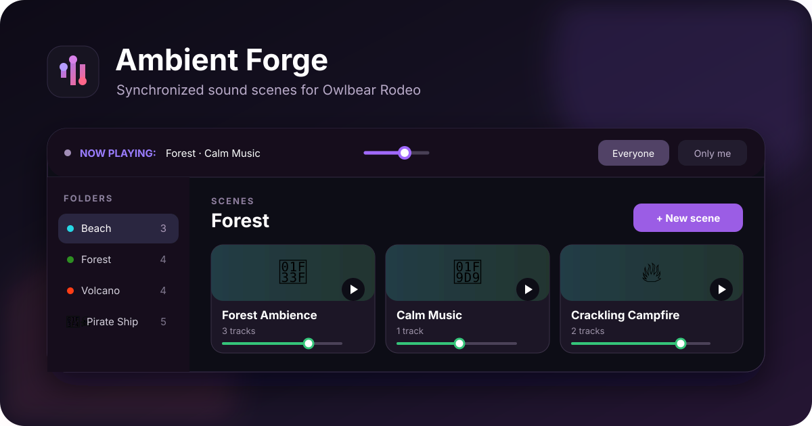

# Ambient Forge



Ambient Forge is an open-source sound scene mixer for [Owlbear Rodeo](https://www.owlbear.rodeo/). Build layered scenes from music, ambience, voices, and effects, then keep playback synchronized with everyone at your table.

## Install

Add this manifest URL as a custom Owlbear Rodeo extension:

```text
https://ambient-forge.marevo.workers.dev/manifest.json
```

Learn more at [ambient-forge.marevo.workers.dev/about](https://ambient-forge.marevo.workers.dev/about).

## Features

- Layer multiple tracks in a single sound scene.
- Organize scenes into colored folders with custom emoji icons.
- Play direct MP3, OGG, WAV, and YouTube sources.
- Control master, scene, and individual track volume.
- Pause and resume without restarting a scene.
- Configure looping, randomized repeat delays, fade in, and fade out.
- Synchronize playback with the room or keep it private to the game master.
- Import and export complete libraries as `.aforge` files.
- Import compatible Djinni music-player libraries.
- Keep audio playing while the extension popover is closed.

## Development

Requirements: Node.js 20 or newer.

```bash
npm install
npm run dev
```

Add `http://localhost:5173/manifest.json` as a custom extension. For a standalone visual preview, open `http://localhost:5173/?preview=1`.

Create a production build with:

```bash
npm run build
```

## Data and privacy

Ambient Forge stores your sound library locally in the browser. Use **Export** to make a portable backup before clearing browser data or moving to another device. Room playback state is shared only as needed to synchronize audio in Owlbear Rodeo.

## Support and contributions

Report bugs or suggest features in [GitHub Issues](https://github.com/marevoteam-wq/ambient-forge/issues). Pull requests are welcome.

## License

Ambient Forge is maintained by **Marevo** and released under the [MIT License](LICENSE).

